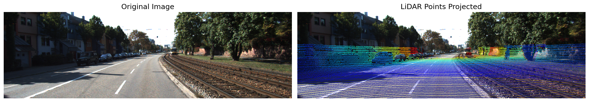
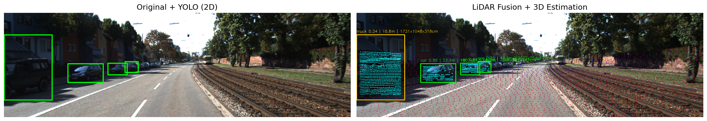
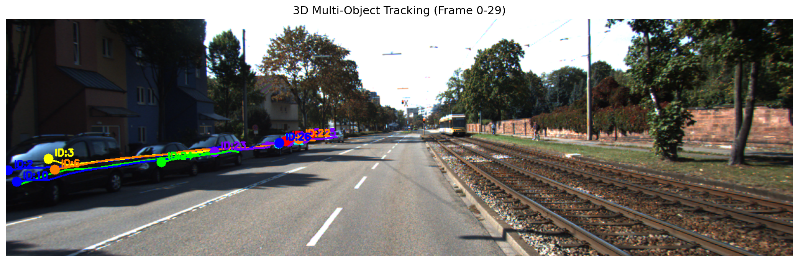

# 🚗 KITTI 3D 多传感器融合感知与跟踪

> 基于 KITTI 自动驾驶数据集，实现 **Camera-LiDAR 融合**的 3D 目标检测，
> 并结合 **Kalman 滤波 + 匈牙利匹配**完成多目标跨帧跟踪。

<p align="center">
  
  
  
</p>

## 概述

| 模块 | 功能 | 技术 |
|------|------|------|
| 传感器融合 | 激光雷达点云 → 相机图像投影 | KITTI 标定参数 (P2 / R / T) |
| 2D 检测 | YOLOv8n 在相机图像上做目标检测 | Ultralytics |
| 3D 定位 | 2D 框内点云聚类 → 3D 位置/尺寸/距离 | NumPy |
| 多目标跟踪 | Kalman 预测 + 匈牙利匹配跨帧关联 | OpenCV KalmanFilter + SciPy |

## 流程图
KITTI 数据集
├─ 相机图像 ──→ YOLOv8 ──→ 2D 检测框
├─ 激光雷达点云 ──→ 投影到图像
└─ 投影点云 + 2D 框
↓
框内 3D 点云聚类
↓
3D 物体位置 / 尺寸 / 距离
↓
Kalman 滤波跨帧跟踪
↓
3D 物体 ID + 运动轨迹
## 核心实现

- **外参投影**：读取 KITTI `calib_velo_to_cam.txt` + `calib_cam_to_cam.txt`，
  构建激光雷达→相机坐标系的 4×4 变换矩阵，将 3D 点云逐点投影到 2D 像素坐标
- **2D-3D 关联**：YOLO 检测框内检索对应点云，计算物体中心、尺寸和距离
- **多帧跟踪**：Kalman Filter（恒定速度模型）预测 + Hungarian 算法做 3D 距离匹配，
  分配固定物体 ID，绘制运动轨迹

## 环境

```bash
conda create -n kitti_fusion python=3.10 -y
conda activate kitti_fusion
pip install torch torchvision --index-url https://download.pytorch.org/whl/cu121
pip install ultralytics open3d numpy opencv-python matplotlib scipy
